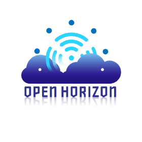

# Open Horizon

-------

Open Horizon一个用于管理容器化工作负载的服务型软件的生命周期和机器学习所需的相关资源的平台。 
它可以自动管理部署到边缘计算节点和设备的分布式应用和服务，且无需IT运维与管理人员亲临机房。

边缘计算使计算和数据存储更接近于人，地点和事物创建数据的位置。 
Open Horizon简化了将如机器学习等应用转移到指定的计算设备上的工作，并使这些应用程序保持运行和更新。
它还可以同时自动管理10,000多个边缘设备，这是传统解决方案中端点数量的20倍。

使用Open Horizon，您可以：

- 向单一用途的设备添加新功能
- 使您的设备能够使用其他服务（附近的服务和基于云的服务）来增强其现有功能
- 在设备上自动化免提管理工作负载生命周期
- 自动将应用程序部署到策略匹配且已协商协议的所有设备上

一旦安装并配置了Open Horizon，就可以管理其执行的工作，而无需物理访问设备。例如，您可以购买一包口香糖大小的Raspberry Pi Zero W设备，
并使其有一天充当离线家庭助理，然后重新分配其任务以监视家庭用电量。或者，您可以让智能相机对准街道，计算一天的行人数量，
然后部署新的代码和模型，以识别下一天经过的车辆的品牌和型号。

无论为构建完整的Cloud-to-Edge工作负载管理实施解决方案，还是解决特定用例的项目，
Open Horizon都旨在以开放的标准化方法与其他解决方案一起协作。

Open Horizon以前称为“ Blue Horizon”，由IBM向LF Edge贡献。 Open Horizon于2020年4月加入LF Edge，成为第1阶段 “At-Large” 项目。

##跨LF边缘协作

Open Horizon已经与其他多个LF Edge项目合作，包括 [EdgeX Foundry](https://www.lfedge.org/projects/edgexfoundry/) ，[Akraino Edge Stack](https://www.lfedge.org/projects/akraino/)，[Home Edge](https://www.lfedge.org/projects/homeedge/)，
[Fledge](https://www.lfedge.org/projects/fledge/)和[Project EVE](https://www.lfedge.org/projects/eve/)。

Open Horizon目前正在与[EdgeX Foundry](https://wiki.edgexfoundry.org/display/FA/Open+Horizon+-+EdgeX+Project+Group)合作，并与他们建立一个集成项目，该项目将保存在其库中。

该项目正在与多个[Akraino Blueprint Families](https://wiki.akraino.org/)成员进行讨论，以作为其解决方案的一部分，在边缘设备的工作负载管理和ML部署管道中的资产交付方面为其蓝图做出贡献。

Open Horizon接下来的合作计划：

- Fledge 提供和管理其解决方案，并将所有需要的ML资产与其来源同步。
- Home Edge可将ML资产从云同步到家庭网关。
- 使用Open Horizon作为POC中EVE工作负载的控制平面，对EVE进行项目设计。

## 会议

定期的社区会议：

China SIG 每周星期五开会一次，在北京时间上午10点 ([转换为您的时区](https://www.thetimezoneconverter.com/?t=10%3A00&tz=GMT%2B8&))与北京时间下午3点之间开 ([转换为您的时区](https://www.thetimezoneconverter.com/?t=15%3A00&tz=GMT%2B8&))

链接:

[会议记录和议程](https://wiki.lfedge.org/display/OH/Open+Horizon+China+SIG)

## 联系

如果您有任何疑问，请随时通过以下方式与我们联系：

- [Discuss in Slack](https://lfedge.slack.com/archives/C011XLC1V2Q)
- [Join the Mailing List](https://lists.lfedge.org/g/open-horizon/topics)

##其他资源
- [View Github](https://github.com/open-horizon/)
- [View Video Resources](https://www.youtube.com/watch?v=NUFRKtn-ED0)

