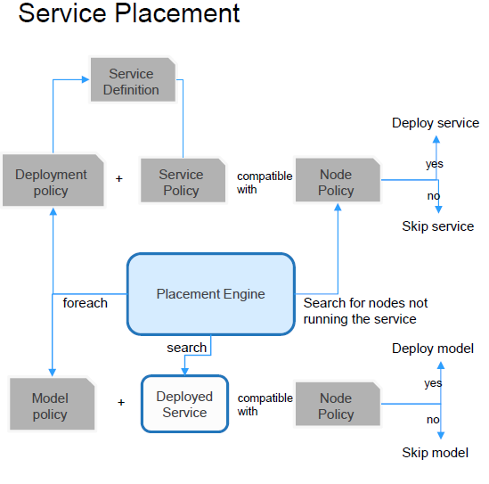

##Open Horizon服务部署的的机制
模式和策略
###介绍
Open Horizon Agent在其节点上（使用Docker的独立Linux计算机或使用k8s的集群）管理应用程序
Open Horizon提供了两种方法来实现应用程序的管理：

1. Patterns
    * 通常更容易使用。
    * 直接指定要运行的服务。
    * 不太强大，不灵活。
2. Policies
    * 声明意图。
    * 基于约束的解决方案。
    * 根据服务策略和业务策略来解析节点策略，以确定部署。
    
###Pattern
Open Horizon模式只是服务的命名集合.使用时您必须指定要包括的服务，然后Open Horizon将添加其声明的依赖项
`hzn交换模式发布..`. 所有将注册的节点都使用您在Pattern指定的名称来注册，且所有这些服务都将被部署
`hzn register -pattern ...`在这些节点上。您可以在注册每个节点时为其定义唯一的配置变量，也可以在创建模式时全局定义它们。
但是任何一个节点上都只能激活一个Pattern。

###Policies
为了使用策略(Policy)机制，您必须定义**deployment**策略，也称为业务策略`hzn exchange deployment addpolicy ...`。
如果您愿意，还可以将**service**策略附加到要部署的服务上。它将自动合并到引用此服务“ hzn exchange service addpolicy ...”的任何部署策略中。
您还必须使用一个**节点**policy `hzn register --policy ...`来注册边缘节点。

####Policies机制
Policies的运行离不开服务安置引擎。

服务安置引擎放置在Agbot中运行。它将连续搜索所有节点与现有部署策略兼容。引擎持续搜索具有与策略运行所在的节点兼容的模型策略的已部署服务
部署政策在逻辑上与“**AND**”服务政策形成完整的政策定义。
兼容性是双向的，即节点策略满足组合部署政策，且组合部署策略满足节点策略。

####Policy概念
Policy的概念如下图所示。

* Policy定义由0个或多个属性组成，并且0或更多的限制。
* 属性具有名称，类型（可选）和值。
* 约束具有零个或多个属性表达式。
* 节点，服务，部署和模型策略每个都有1个策略定义。
* 服务定义和服务策略是独立的实体与1..1关系。
* 部署策略和模型策略是独立的实体每个都引用服务定义。
* 部署策略可能引用服务的多个版本表示服务回滚指令。
* 模型策略可能引用多个服务定义，例如将与模型一起部署的每个服务。

