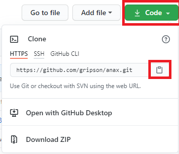
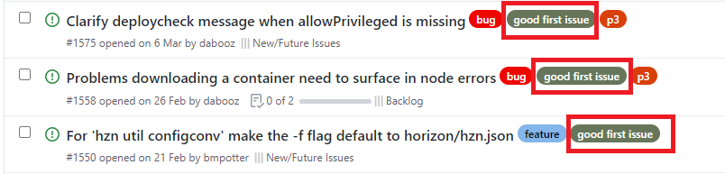

##代码贡献
我们感谢所有以及各种形式为Open Horizon做出贡献的参与者们。

如果您想为Open Horizon添砖加瓦作出贡献，请阅读以下内容。 
本文档包含许多技巧和指南。

###Fork Open Horizon仓库
首先访问[Open Horizon](https://github.com/open-horizon/)的Github组织页面并选择想要贡献的子项目，如anax（本篇向导将以anax为例）。
通过单击anax项目页面顶部右上角的fork按钮来克隆此存储库。这将在您的Github帐户中创建此存储库的副本。


###克隆远程仓库


转到您的GitHub帐户，打开分支的存储库，单击“code”按钮，然后单击“copy to clipboard ”图标。
打开一个终端并运行以下git命令：
```bash
git clone "url you just copied"
```
其中“url you just copied”（不带引号）是该存储库（您的项目fork）的网址。

###选择 first issue
在open-horizon/anax项目的Issues一栏下您能挑选自己感兴趣的issue。建议挑选有“good first issue”标签的issue，
如果您是第一次参与Open Horizon项目。



###创建本地分支
转到计算机上的存储库目录：
```bash
cd anax
```
现在使用git checkout命令创建一个分支：
```bash
git checkout -b <add-your-new-branch-name>
```
建议新分支的命名根据issue类别分类方便自己辨识，如果是bug那么建议命名为bugfix/issue号，如果是feature那么用feature/issue号:
```bash
git checkout -b bugfix/issue1575
```
###进行必要的更改
现在，做任何您想为该项目做的事情，并对现有文件进行必要的更改或添加新文件。

###本地测试并将更改推送到GitHub
在将更改推送到GitHub之前，请确保您在本地通过测试。

####准备
根据[本地开发指南](../contributor-guide/local-development.md)搭建e2edev环境并确保单元测试`make test`和集成测试`make test TEST_VARS="NOLOOP=1 PATTERN=sloc"`
顺利通过。

####提交变更
一旦您对更改进行了成功的本地测试，就可以提交这些更改。如果转到项目目录并执行命令git status，您将看到所做的更改。
将这些更改添加到使用git add命令刚创建的分支中：
```bash
git add <file> 
```
所有提交都应该附带签名（git commit上的-s标志）。 要使用-s选项，请遵循[指导](https://github.com/open-horizon/open-horizon.github.io/blob/master/common-requests/contribute.md#how-to-attest)以确保您配置了git名称（user.name）和电子邮件地址（user.email）。
```bash
git commit -s -m "Fix xxxx issue"
```
将更改推送到您的GitHub, 使用命令git push推送更改：
```bash
git push origin <add-your-branch-name>
```
将<add-your-branch-name>替换为您先前创建的分支的名称。

###提交Pull Request

如果您转到GitHub上的存储库，则会看到“Compare & pull request button”按钮, 单击该按钮。


现在，通过单击`Create pull request`来提交Pull Request请求。


合并更改后，您将收到一封通知电子邮件。

###保持与upstream仓库的同步
通过将本地存储库添加为远程存储库，将其连接到原始的“upstream”存储库。 经常从“upstream”拉取更改，以便保持最新状态，以便在提交拉取请求时，合并冲突的可能性较小。
您可以参阅Github官方指南[Sync a fork of a repository to keep it up-to-date with the upstream repository](https://docs.github.com/en/github/collaborating-with-issues-and-pull-requests/syncing-a-fork)。
按照以上方法如果本地分支落后于upstream分支，会产生一个新的`merge commit`多余信息。
如果你不想有多余的合并记录，你可以参考以下方法：

1首先列出您的fork的当前配置的远程存储库:
```bash
git remote -v
```
2 指定将与fork同步的新的remote upstream资源库, 以anax为例:
```bash
git remote add upstream https://github.com/open-horizon/anax.git
```
3 验证您为fork指定的新upstream资源库:
```bash
git remote -v
```
4 抓取原仓库的所有修改文件
```bash
git fetch --all
```
5 使用`git rebase`合并commit:
```bash
git pull --rebase upstream master 
//等同于以下两条命令
git fetch upstream master
git rebase upstream/master
```
6 将修改push到自己的远程仓库
```bash
git push
```