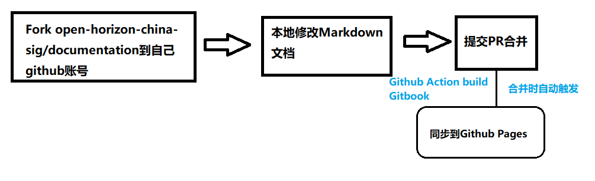

##文档贡献
一些重要文档和语法的说明和事例

###文档贡献流程概览
如果您想贡献，请阅读以下内容。 

1. Fork 文档到自己的Github
2. 本地修改文档，在本地修改完文档后，提交对应的PR到open-horizon-china-sig/documentation
3. 社区负责人检查无误后，合并到Master分支
4. 合并时GitHub Action触发且build型的Gitbook发布到Github Pages