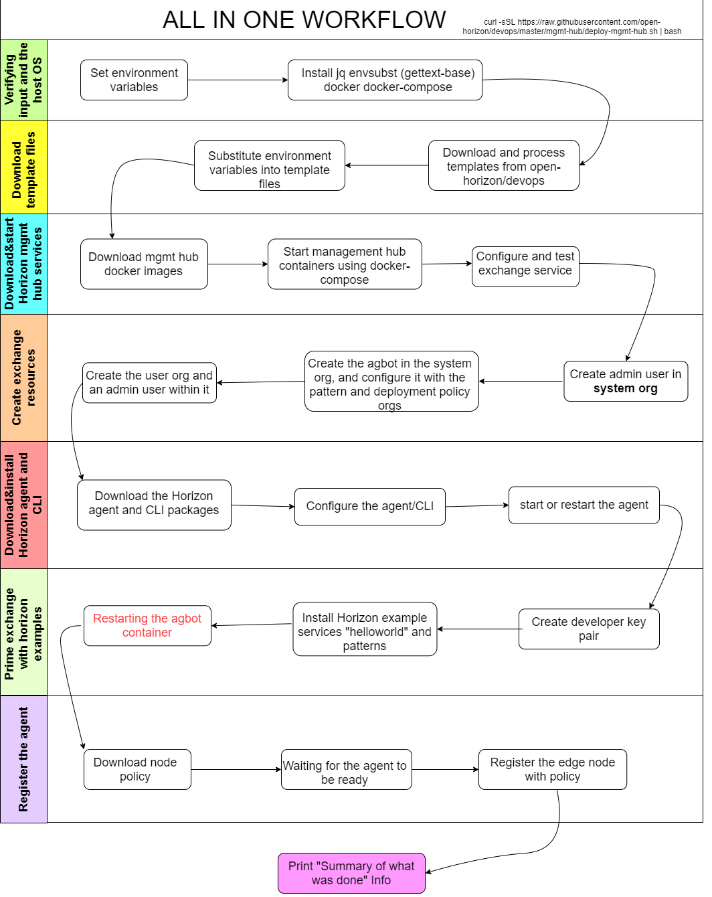

## 单机虚拟环境(VM)搭建
### 准备

要在一个虚拟机中同时运行Open Horizon管理中心(Management Hub)，代理(Agent), 命令工具(CLI)和Intel SDO (Secure Device Onboard)集成版，您需要一个符合以下要求的虚拟机(VM)：

- 大于等于4GB内存
- 至少20GB储存空间
- Ubuntu Server 18.04 LTS

观看安装视频[Video](https://youtu.be/YQqFnRNL98s)


视频中提到的相关链接:

- [Ubuntu Server 18.04 LTS for AMD64](http://cdimage.ubuntu.com/ubuntu/releases/18.04/release/ubuntu-18.04.5-server-amd64.is)
- [VirtualBox 6.1](https://www.virtualbox.org/wiki/Downloads)
- [Open Horizon Management Hub installation instructions](https://github.com/open-horizon/devops/blob/master/mgmt-hub/README.md)
- [Open Horizon project](https://www.lfedge.org/projects/openhorizon/)

### 安装
要在一个VM里安装所有服务的简单且易于开发的版本，请在Ubuntu 18.04的x86_64计算机上切换为root身份：
```bash
sudo -i
```
运行以下指令:
```bash
curl -sSL https://raw.githubusercontent.com/open-horizon/devops/master/mgmt-hub/deploy-mgmt-hub.sh | bash
```
### 工作流程
